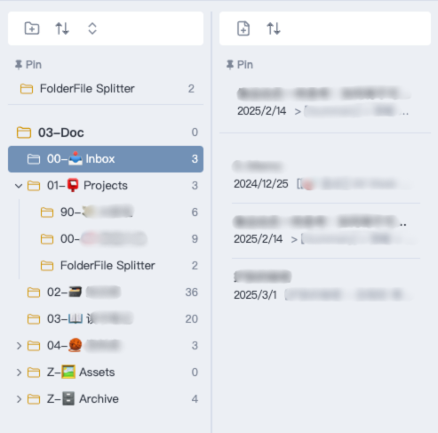

# FolderFile Splitter Plugin

[English](./README.md) | [中文](./README-CN.md)

**FolderFile Splitter** is an Obsidian plugin that brings a fresh approach to file management by splitting folders and files into distinct, visually separated lists. Inspired by Apple's elegant design principles, this plugin offers a cleaner, more intuitive way to browse and organize your notes.

🌟 Love this plugin? If **FolderFile Splitter** improves your workflow, consider [**buy me a coffee via KodeCoffee**](https://kodecoffee.com/i/xuquan). Every contribution fuels future updates and features!

## Features

- **Split View**: Separates folders and files into different panels for a better overview of your note structure.
- **Improved Navigation**: Navigate through folders and files effortlessly without losing track of your location.
- **Enhanced File Management**: Focus on what matters most with a streamlined interface that prioritizes usability.
- **Customizable Sorting**: Allows users to customize the order of files and folders, including the ability to pin specific items to the top for quick access.
- **Pin Files and Folders**: Easily pin frequently used files or folders to the top of the list for faster access and better organization.
- **Theme Adaptation**: Automatically adapts to the current Obsidian theme, ensuring a cohesive and visually appealing experience.
    

## Install
### Method 1: Install from Obsidian Community Plugins (Recommended)
1. **Search for the Plugin**
   - In Obsidian, navigate to **Settings → Community Plugins**.
   - Click **Browse** and search for **FolderFile Splitter**.
2. **Install and Enable the Plugin**
   - Click **Install**, then go back to the **Installed Plugins** section.
   - Enable **FolderFile Splitter** to start using it.

### Method 2: Manual Installation

1. **Download the Plugin**
   - Go to the [Releases](https://github.com/XuQuan-nikkkki/FolderFile-Splitter-Plugin/releases) section of this repository.
   - Download the latest `.zip` file.

2. **Extract and Place in the Plugins Folder**
   - Extract the downloaded `.zip` file.
   - Move the extracted plugin folder into your Obsidian vault's `.obsidian/plugins` directory.
   - If you can't find the `.obsidian` folder, it might be hidden. You can enable hidden files using:
     - **Windows:** Press `Ctrl + Shift + .` in File Explorer.
     - **Mac:** Press `Cmd + Shift + .` in Finder.

3. **Enable the Plugin in Obsidian**
   - Open Obsidian and go to **Settings → Community Plugins**.
   - Enable the newly installed plugin.

## Uninstall

To uninstall the plugin, simply disable or delete it from the Obsidian plugin settings. If you need to reset all settings, clear the plugin settings from the settings menu.

## What's Next

- **Customizable Settings**: Allow users to customize the plugin’s behavior, such as setting the default location for new files or folders.
- **Mobile Support**: Adapt the plugin for use on Obsidian's mobile app, ensuring seamless file management across devices.
- **Tag-Based Management**: Introduce the ability to manage files using tags for a more flexible organization system.

## Changelog

- **v0.1.0**: Initial release with folder/file split view and improved navigation.
- **v0.2.0**: Added customizable sorting, pinning of files and folders, and theme adaptation.

## Feedback & Issues

If you encounter any bugs or have feature suggestions, please open an issue on this [GitHub repository](https://github.com/XuQuan-nikkkki/FolderFile-Splitter-Plugin). Your feedback is invaluable in helping us improve FolderFile Splitter!
